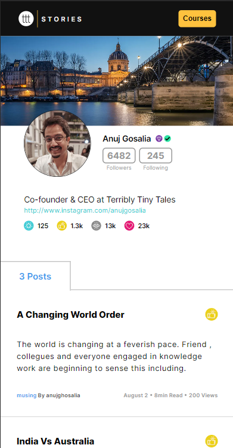
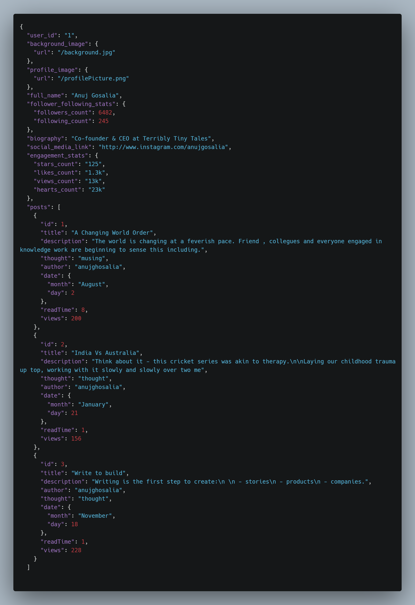

# Terribly Tiny Tales Assignment 

## Snapshot:

## Technology Used:

1. **Next.js**
2. **Styled Components** (styling purpose)

## File Structure:

The page.js file contains three primary components:

1. **NavBar**
   * NavBar component contains the code of the navbar including the logo, header, the course button.
2. **UserProfile**
    * UserProfile component contains the profile of the user including the banner image, profile image, name , membership icons, social media links, activity stats(passes with the help of the helping component-'ActivityStats').
3. **Posts**
    * Posts component also have a sub component called post.
    * Post passes the properties of the posts like a formatter
    * both of them sums up to show the written posts of the user(static).

### Helping Components-
(post.jsx, ActivityStats.jsx, NavButton.jsx(UI))

## Data:

The **userProfile.json** file is queried for user information, which is then used to establish the **userDetails** state in **page.js**. This is the structure of the user data:

# Follow the procedure to run this project in youn system:

- Clone the repository.

- Install dependencies: `yarn`.
- Run the development server: `yarn dev`.
  Open http://localhost:3000 in your browser to view the application.
